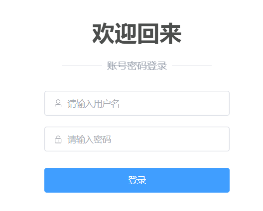
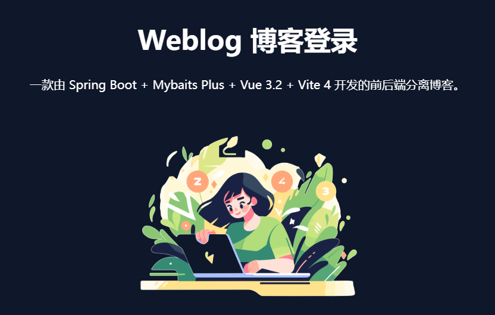
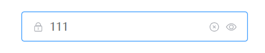

# WebLog博客网站

## 项目介绍

-   每个技术人都应该有属于自己的博客！相比较直接使用第三方博客平台，自行搭建博客更有成就感；没有平台限制,还有可以自由 `div` 定制自己想要的博客 `css` 样式.

### 项目目标

1. 掌握独立开发全栈项目的能力（*后端 + 前端*）；
2. 掌握 Spring Boot 相关技术栈，以及构建后端项目能力，写出符合企业级的代码规范；
3. 掌握 Vue 3.x + Element Plus + Vite 4 技术构建前端工程的能力，并能够手动搭建 Admin 后台管理系统；
4. 掌握前端页面响应式设计（同时适配不同屏幕），排版布局，能够根据自己需求，`div` 自己想要的前端效果；
5. 能够独立完成整个网站的部署流程，从本地功能开发，功能测试，再到部署到云服务器上、域名选购、网站备案，最终公网可访问；

### 技术亮点

- 在技术选型上，选择了目前主流热门的技术栈，对标企业级项目开发；
- 严格把控代码质量，数据库设计，写出高效简介的代码；
- 熟悉后端工程的搭建，如一些通用的基础设施：参数校验、全局异常捕获、`API` 统一出入参日志打印等等；
- 能够独立完成整个网站的部署流程，从本地功能开发，功能测试，再到部署到云服务器上、域名选购、网站备案，最终公网可访问；
- 对象存储 `Minio` 的使用, 能够独立搭建个人图床；
- 从 0 到 1 ，通过 `Element Plus` 纯手搭 `Admin` 管理后台前端骨架；
- 使用 Vue 3 `setup` 等语法糖新特性, 组合式 `API` 来开发；

### 结构插件介绍

- 搭建 Spring Boot 多模块工程骨架:weblog-springboot为父模块,
  1. `weblog-web` 模块，此模块是项目的入口，Maven 打包的打包插件放在这里，同时，和博客前台页面展示相关的功能也统一放在此模块下;
  2. `weblog-module-admin` 模块: 一个负责 Admin 管理后台功能的子模块，此模块用于统一放置和 Admin 管理后台相关的功能;
  3. `weblog-module-common` 模块:此模块专门用于存放一些通用的功能，如接口的日志切面、全局异常管理等等;
  4. `weblog-module-jwt`模块 : 此模块负责admin的身份认证和信息校验,博客前台可以被任何人访问,所以不对前台做身份校验;
  
- 插件与基本工具类配置
  1. Lombok 是一个超酷的 Java 库 : **避免编写那些冗余的 Java 样板式代码**，如对象中的 `get`、`set`、`toString` 等方法，解放双手，堪称偷懒神器;
  2. Logback 是日志框架 SLF4J 的一个实现 : **日志可以帮助我们监控、调试和跟踪代码的运行情况**Logback 提供了更高的性能，更丰富的日志功能和更好的配置选项;
  3. 使用jackson库对数据进行转换json格式处理,使响应数据更容易操作与阅读.
  4. 自定义注解 : 实现 API 请求日志切面,可以为所有使用 `@ApiOperationLog` 注解的方法自动添加日志逻辑，而不需要在每个方法中手动添加
  5. MDC 实现日志追踪功能 : ***为每个请求分配一个唯一的标识，并将该标识添加到每条日志消息中，从而方便地区分和跟踪每个请求的日志*;**
  6. JSR 380 参数校验注解 : 该规范定义了一系列注解，用于验证 `Java Bean` 对象的属性，确保它们满足某些条件或限制。**使用注解来为实体类参数上方之间添加参数校验.**
  7. 实现全局异常管理 : 在没有全局异常管理的情况下，每个控制器或 `service` 服务中可能都会有各种 `try-catch` 代码块来捕获和处理异常。避免**代码重复;不一致的响应格式;增加维护成本 ;可读性差;**
  8. 整合 Mybatis Plus : **快速开发**：MyBatis Plus 提供了一系列的便捷功能，如自动生成 SQL 语句、通用 Mapper 等，使数据库操作更加高效，能够节省开发时间。**更少的配置**： Spring Boot 已经为我们提供了很多默认的配置，整合 MyBatis Plus 时只需少量的配置，减少了繁琐的配置步骤。
  9. 整合p6spy 组件 : 一方面可以了解到每个操作都具体**执行的什么 SQL 语句**， 另一方面通过**打印执行耗时**，也可以提前发现一些慢 SQL，提前做好优化;
  10. 整合 Spring Security : 作为 Spring 框架的一部分，Spring Security 提供了强大的功能，帮助开发人员实现**身份认证、授权、会话管理以及其他与安全**相关的任务。
  11. 整合 JWT ：实现身份认证 : JWT（JSON Web Token）是一种用于在不同应用之间安全传输信息的开放标准（RFC 7519）。它是一种基于 JSON 的轻量级令牌，由三部分组成：头部（Header）、载荷（Payload）和签名（Signature）。JWT 被广泛用于实现身份验证和授权，**特别适用于前后端分离的应用程序**。当用户名、密码输入正确时，返回 Token 令牌，否则提示错误信息。
  12. JWT ：实现接口鉴权 : 在现代的 Web 应用程序中，接口鉴权是一个重要的安全考虑因素。**通过接口鉴权，您可以确保只有经过身份验证和授权的用户能够访问特定的接口和资源。**我们通过 Spring Security + JWT 已经实现了用户认证功能，新增后端程序中拿到令牌，对接口进行鉴权，若令牌正确，则可正常访问接口资源，否则提示对应错误信息。
  13. 
  
- 前端搭建整合组件和css库

  1. 整合 vue-router 路由管理器 :  `Vue Router` 是 Vue.js 官方提供路由管理器。在一个标准的单页面应用中，**仅有一个 HTML 页面被服务器发送到客户端**。随后的页面内容都是通过 `JavaScript` 动态替换生成的。这时候，就需要 Vue Router 来管理这些页面的导航和组织。
  2. Vite 配置路径别名 : `alias` 是一个用于定义路径别名的配置选项。当你的项目结构变得复杂时，**路径别名可以帮助你简化 `import` 或 `require` 语句中的路径**，让代码更干净、更可维护。
  3. 整合 Tailwind CSS : Tailwind CSS 是一个高度可定制的、实用工具优先的 CSS 框架，它使你能够通过组合小型、单一用途的类来构建现代网站界面，**而无需写任何 CSS**。Tailwind CSS 在生产环境中会**自动移除未使用的样式，这有助于保持 CSS 文件大小最小**。
  4. 组件库：Flowbite : Flowbite 是一个基于 Tailwind CSS 创建的组件库，旨在帮助开发者**快速构建现代、响应式的 Web 应用界面。**
  5. Element Plus 组件库 : Element Plus 是一个专为 Vue 3 设计的 UI 组件库。它提供了一整套丰富且高质量的组件，从基本的按钮和输入框到复杂的日期选择器和数据表格。这些组件不仅样式美观，而且具有广泛的定制选项。**同时，它也是目前企业级 Admin 管理后台中，使用广度非常高的一个组件框架。**
  6. Animate.css 添加入场动画 : `Animate.css` 是一个跨浏览器的 CSS 动画库，**提供了许多预设的、流畅的动画效果。用户只需添加几个 CSS 类名，就可以轻松实现复杂的动画效果**，无需编写任何 JavaScript 代码。
  7. 整合 Axios 实现登录功能（解决跨域问题) : 

  ### 登录模块开发

  1. ##### 登录页设计：支持响应式布局 :

     **基本布局** : 首先，我们通过 Tailwind 的 `grid` 网格布局，实现一个登录页面的基本骨架，分为左边栏和右边栏

     1. 右边栏登录表单 : 引入了 Element Plus 表单组件 , 并添加了两个输入框和一个登录按钮,美化组件上方文字

     2. 

     3. 左边栏登录设计  : 添加了一些描述性的文字，以及一张背景色透明的图片

     4. 

        

  2. ##### 通过 `Animate.css` 给登录页添加入场动画

     1. 让页面过渡更加友好 : 添加弹跳动画 ,给右边栏的父级 `div` 添加 `bounceInRight`,同理给左边`div`添加向右弹跳动画.

  3. ##### `p6spy` 组件打印完整的 SQL 语句、执行耗时

     1. 一方面可以了解到每个操作都具体执行的什么 `SQL` 语句， 另一方面通过打印执行耗时，也可以提前发现一些慢 SQL
     2. 添加`applcation-prod.yml`配置文件,区分开发环境和上线环境

  4. ##### Spring Security 整合 `JWT` 

     1. **灵活性** : `JWT` 可以存储任意格式的数据，使其成为传递用户信息、权限、角色等的理想选择。
     2. **安全性**：`JWT` 使用签名进行验证，确保信息在传输过程中不被篡改。
     3. **`PasswordEncoder` 密码加密**  : 在系统中，安全存储用户密码是至关重要的。使用明文存储密码容易受到攻击，因此使用密码加密技术来保护用户密码是必不可少的。
     4. **使用 `BCrypt` 算法对密码进行加密**。`BCrypt` 是一种安全且适合密码存储的哈希算法，它在进行哈希时会自动加入“盐”，增加密码的安全性。
     5. **实现接口鉴权** : 通过 `Spring Security` + `JWT` 已经实现了用户认证功能，当用户名、密码输入正确时，返回 Token 令牌，否则提示错误信息。将在后端程序中拿到此令牌，对接口进行鉴权，若令牌正确，则可正常访问接口资源，否则提示对应错误信息。

  5. ##### `Axios` 实现跨域问题

     1. `Axios` 是一个流行的用于发起 `HTTP` 请求的 `JavaScript` 库。它可以在浏览器和 `Node.js` 环境中使用，提供了一种简洁且强大的方式来处理异步网络请求。
     2. 整合 `Axios` 并调用登录接口，当登录成功后，跳转后台首页的功能就完成了.

  6. ##### 登录页表单验证

     1. 除了后端要校验外，前端也需要校验，并给予用户友好的提示信息。
     2. `Element Plus` 提供的 Form 组件允许你验证用户的输入是否符合规范，来帮助你找到和纠正错误。只需为 `rules` 属性传入约定的验证规则，并将 `form-Item` 的 `prop` 属性设置为需要验证的特殊键值即可.

  7. ##### 回车键监听

     1. **交互做的好一点** ,当输入完用户名、密码后，直接敲击回车键就能完成登录了。
     2. 引入了 `onMounted` 、`onBeforeUnmount` 生命周期方法，然后在 `onMounted()` 方法中添加了键盘监听事件，当键盘的 `key` 值为 `Enter` 时，也就是回车键时，直接调用 `onSubmit()` 登录。然后在 `onBeforeUnmount()` 生命周期方法中，移除了键盘监听事件。

  8. ##### 按钮加载

     1. 当触发登录后，会调用后台接口，网络 IO 可能会消耗一点时间，为了给用户一个友好的提示，显示加载 Loading 非常有必要
     2. Element Plus 提供的按钮组件提供了加载属性 `loading`, 通过设置为 `true` 或者 `false` 来决定是否要显示加载状态。上述代码中，声明了一个响应式的变量 `loading`, 在请求登录接口的开始，将其设置为了 `true`, 然后请求结束后，将其设置为 `false`, 恢复正常样式。

  9. ##### 存储 Token 到 Cookie 中

     1. `Cookie`是一种用于在客户端和服务器之间传递信息的小型文本文件。它通常由服务器发送给用户的浏览器，然后浏览器将这些信息存储在用户的计算机上，以备将来的使用.
     2. 使用`VueUse` 工具库简化js操作开发,其中`useCookies` 提供了一些 `API` ，用于操作 `Cookie`

  10. ##### 密码框显示明文小眼睛

      1. 密码框输入密码，默认都是点点点这种密文形式，为了保护数据的安全性，不对用户可见的，
      2. 但是，比较好的交互模式是，用户可手动设置密码可见
      3. 
      4. `Element Plus` 提供的密码框组件默认提供了此功能，只需添加 `show-password` 属性即可得到一个可切换显示隐藏的密码框。

  11. ##### 重复登录问题

      1. 当用户成功登录后，再次访问登录页时，你会发现依然可以访问，这样就会导致用户*重复登录*的问题。*正确的逻辑应该是，当用户已经登录，则跳转后台首页*。
      2. 在路由的前置守卫中,新添加了一个 `else if` 判断，单独对当 `Token` 令牌不为空，也就是用户已登录，且访问登录页的情况，提示用户*请勿重复登录*，并强制跳转到后台首页。

###   admin模块开发

​	1. 

